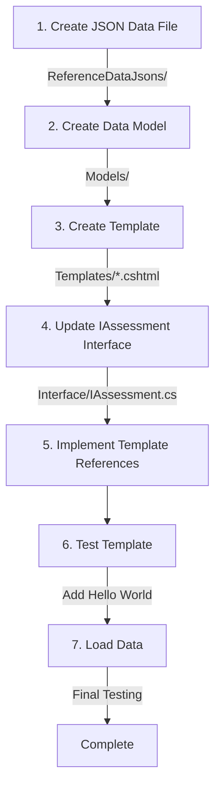

How to add new pdfs for development.

## Process Overview



## Detailed Steps

1. **Create JSON Data Files**
   - Location: `ReferenceDataJsons/`
   - Purpose: Define the data structure for your new PDF
   ```json
   {
     "sampleField": "value",
     "nestedData": {
       "field1": "value1"
     }
   }
   ```

2. **Create Data Model**
   - Location: `Models/`
   - Purpose: C# class that matches your JSON structure
   ```csharp
   public class NewTemplateModel
   {
       public string SampleField { get; set; }
       public NestedData NestedData { get; set; }
   }
   ```

3. **Create Template File**
   - Location: `Templates/`
   - File: `NewTemplate.cshtml`
   - Start with a simple test:
   ```cshtml
   @model YourNamespace.Models.NewTemplateModel
   <p>Hello World!</p>
   ```

4. **Update IAssessment Interface**
   - Location: `Interface/IAssessment.cs`
   - Add your new template type

5. **Implement Template References**
   - Search for `//ADD FORMS HERE` comments
   - Update all necessary locations
   - Ensure proper implementation of IAssessment interface

6. **Project Structure**
   ```
   📁 ReferenceDataJsons/
   ├── 📄 your-new-template.json
   📁 Models/
   ├── 📄 NewTemplateModel.cs
   📁 Templates/
   ├── 📄 NewTemplate.cshtml
   📁 Interface/
   ├── 📄 IAssessment.cs
   ```

7. **Testing Process**
   - First test with Hello World
   - Then gradually add data fields
   - Verify JSON data mapping
   - Check PDF generation

## Common Issues and Solutions

- If template doesn't appear in dropdown: Check IAssessment interface implementation
- If data doesn't load: Verify JSON file format and model property names
- If PDF generation fails: Start with minimal template and add complexity gradually