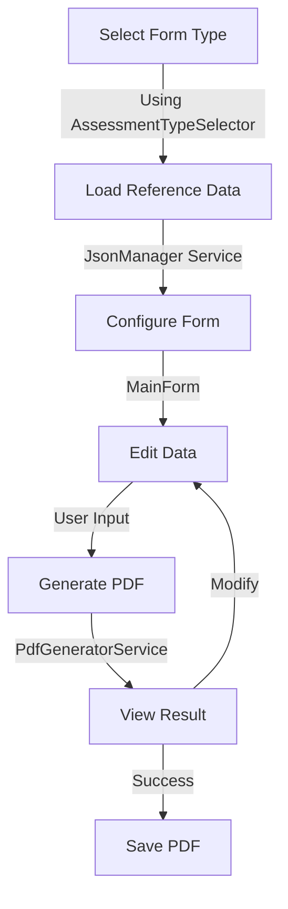
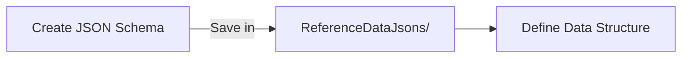
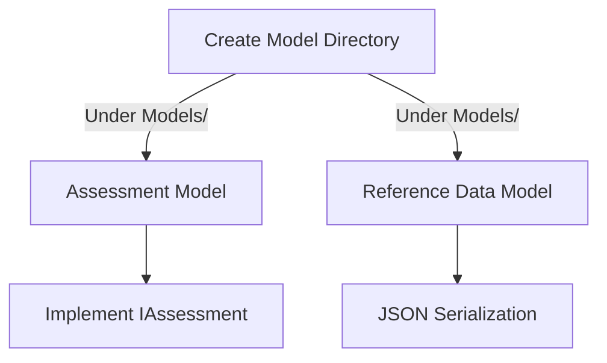

# iText Designer with GUI

This application allows users to generate multiple types of PDFs using iText7 for .NET, with support for multiple data sets and templates. Helping the user quickly update 
a html & CSS template and view the generated PDF.

## 🏗️ Project Structure

```
iTextDesignerWithGUI/
├── 📂 Forms/
│   ├── MainForm.cs              # Main application window
│   └── AssessmentTypeSelector.cs # Form type selection dialog
├── 📂 Models/
│   └── [Assessment-specific models] # Data models for each form type
├── 📂 Services/
│   ├── PdfGeneratorService.cs   # Core PDF generation logic
│   └── JsonManager.cs           # JSON data handling
├── 📂 Templates/
│   └── [HTML templates]         # HTML/CSS templates for PDFs
└── 📂 ReferenceDataJsons/
    └── [JSON data files]        # Reference data for forms
```

## 🔄 Process Flow



## 📝 Adding a New Form Type

### 1. Reference Data Setup


### 2. Data Model Creation


### 3. GUI Integration
- In `AssessmentTypeSelector.cs`:
  - Add to `AssessmentType` enum
  - Update dropdown menu
  - Handle selection events

- In `JsonManager.cs`:
  - Implement data loading
  - Add deserialization support
  - Handle file operations

- In `MainForm.cs`:
  - Add UI controls
  - Setup data validation
  - Configure template handling

### 4. PDF Generation Setup
- In `PdfGeneratorService.cs`:
  ```
  ┌─────────────────────┐
  │ 1. Load JSON Data   │
  ├─────────────────────┤
  │ 2. Process Model    │
  ├─────────────────────┤
  │ 3. Map Data         │
  ├─────────────────────┤
  │ 4. Replace Content  │
  ├─────────────────────┤
  │ 5. Generate PDF     │
  └─────────────────────┘
  ```

### 5. Template Configuration
- Create HTML template in `Templates/`
- Link to `globalStyles.css`
- Test with sample data
- Implement data bindings
- Add Bootstrap styling


